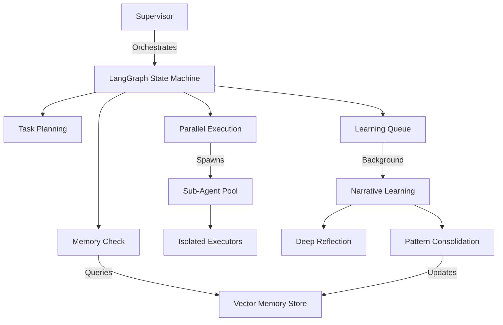

# 🧠 Learning Agent

[](https://www.python.org/downloads/)
[](https://github.com/astral-sh/ruff)
[](http://mypy-lang.org/)
[](https://smith.langchain.com)

A sophisticated autonomous agent system that learns from experience, orchestrates parallel task execution, and adapts its behavior based on past successes and failures.

## ✨ Features

- **🔄 Autonomous Learning**: Learns from every task execution, building a memory of successful patterns
- **⚡ Parallel Orchestration**: Executes multiple tasks simultaneously using LangGraph's Send API
- **🧩 Multi-Agent Coordination**: Dynamic sub-agent spawning with isolated execution contexts
- **📝 Narrative Memory**: Creates human-readable narratives of experiences for better context understanding
- **🔍 Pattern Recognition**: Automatically identifies and applies successful patterns to new tasks
- **🎯 Checkpoint/Resume**: Full state persistence for long-running tasks
- **📊 LangSmith Integration**: Complete observability of agent execution and learning processes

## 🚀 Quick Start

### Prerequisites

- Python 3.11 or higher
- [uv](https://github.com/astral-sh/uv) package manager (recommended) or pip
- OpenAI API key or other supported LLM provider

### Installation

```bash
# Clone the repository
git clone https://github.com/johannhartmann/learning-agent.git
cd learning-agent

# Install with uv (recommended)
uv sync --all-extras

# Or install with pip
pip install -e ".[dev]"

# Copy environment variables
cp .env.example .env
# Edit .env and add your API keys
```

### Basic Usage

```python
import asyncio
from learning_agent.supervisor import Supervisor

async def main():
    # Initialize the supervisor
    supervisor = Supervisor()

    # Process a task - the agent will plan, execute, and learn
    result = await supervisor.process_task(
        "Create a Python function to calculate fibonacci numbers and test it"
    )

    print(f"Task completed: {result['status']}")
    print(f"Summary: {result['summary']}")

    # The agent has now learned from this experience
    # Future similar tasks will be executed more efficiently

    await supervisor.shutdown()

asyncio.run(main())
```

## 🏗️ Architecture

The Learning Agent uses a sophisticated multi-layer architecture:



### Core Components

- **Supervisor**: Main orchestrator using LangGraph for state management
- **Narrative Learner**: Creates and maintains episodic memories with reflection
- **Orchestrator**: Manages parallel task execution with dependency resolution
- **Sub-Agents**: Isolated execution environments for individual tasks
- **Memory Store**: Vector database for similarity-based experience retrieval

## 🧪 Testing Strategy

This project uses a hybrid testing approach combining traditional unit tests with LangSmith-based probabilistic testing:

```bash
# Run all tests
make test-all

# Traditional unit tests
make test-unit

# Integration tests
make test-integration

# LangSmith probabilistic tests
make langsmith-test

# Generate regression tests from production
make langsmith-regression
```

See [tests/README.md](tests/README.md) for detailed testing philosophy.

## 📊 Observability

The agent provides full observability through LangSmith:

1. **Trace Every Decision**: Complete visibility into planning and execution
2. **Learning Metrics**: Track pattern recognition and application
3. **Performance Monitoring**: Latency, token usage, and cost tracking
4. **Anomaly Detection**: Automatic detection of behavioral changes

Configure LangSmith in your `.env`:
```env
LANGSMITH_TRACING=true
LANGSMITH_API_KEY=your_api_key
LANGSMITH_PROJECT=learning-agent
```

## 🛠️ Development

### Setup Development Environment

```bash
# Install development dependencies
make install-dev

# Install pre-commit hooks
make pre-commit-install

# Run all quality checks
make check
```

### Available Commands

```bash
make help              # Show all available commands
make test             # Run tests
make lint             # Run linting
make format           # Format code
make typecheck        # Type checking
make security         # Security scan
make deadcode         # Find unused code
```

### Code Quality

- **Linting**: Ruff with extensive rule set
- **Type Checking**: Strict mypy configuration
- **Security**: Bandit for security issues
- **Dead Code**: Vulture for unused code detection
- **Coverage**: Pytest-cov with 52% traditional coverage + LangSmith probabilistic testing

## 🤝 Contributing

We welcome contributions! Please see [CONTRIBUTING.md](CONTRIBUTING.md) for guidelines.

### Development Workflow

1. Fork the repository
2. Create a feature branch (`git checkout -b feature/amazing-feature`)
3. Make your changes
4. Run tests (`make test-all`)
5. Commit your changes (`git commit -m 'Add amazing feature'`)
6. Push to the branch (`git push origin feature/amazing-feature`)
7. Open a Pull Request

## 📚 Documentation

- [Testing Strategy](tests/README.md)
- [Contributing Guidelines](CONTRIBUTING.md)

## 🔧 Configuration

The agent is highly configurable through environment variables:

```env
# LLM Configuration
LLM_PROVIDER=openai
LLM_MODEL=gpt-4o-mini
LLM_TEMPERATURE=0.7

# Learning Configuration
ENABLE_LEARNING=true
LEARNING_CONFIDENCE_THRESHOLD=0.9
PATTERN_RETENTION_DAYS=90

# Performance
MAX_PARALLEL_AGENTS=10
TASK_TIMEOUT_SECONDS=300
```

See [.env.example](.env.example) for all options.

## 🚦 Project Status

This project is in active development. Current focus areas:

- [ ] Implement long-term memory consolidation
- [ ] Add support for additional LLM providers
- [ ] Enhance pattern recognition algorithms
- [ ] Implement collaborative multi-agent learning
- [ ] Add web UI for monitoring

## 📝 License

License pending - see [LICENSE](LICENSE) file once added.

## 🙏 Acknowledgments

Built with:
- [LangChain](https://langchain.com/) - LLM orchestration
- [LangGraph](https://langchain-ai.github.io/langgraph/) - State machine orchestration
- [LangSmith](https://smith.langchain.com/) - Observability and testing
- [Rich](https://rich.readthedocs.io/) - Terminal UI

## 📬 Contact

Johann Hartmann - [@johannhartmann](https://github.com/johannhartmann)

Project Link: [https://github.com/johannhartmann/learning-agent](https://github.com/johannhartmann/learning-agent)
